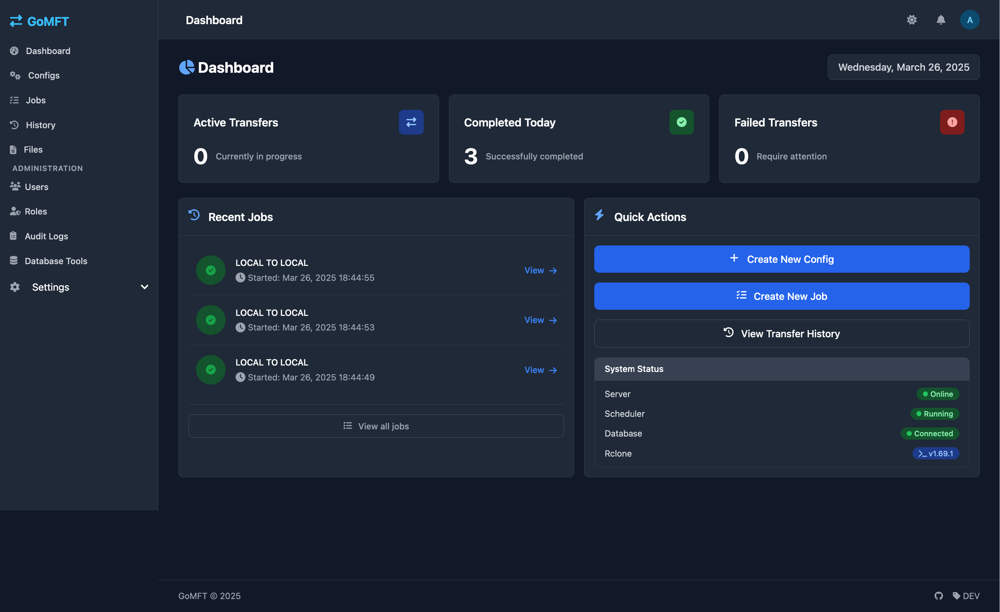
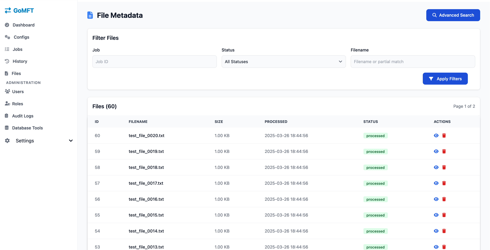

# GoMFT - Go Managed File Transfer

GoMFT is a web-based managed file transfer application built with Go, leveraging rclone for robust file transfer capabilities. It provides a user-friendly interface for configuring, scheduling, and monitoring file transfers across various storage providers.

## Screenshots

### Dashboard

*Dashboard showing active transfers and system status*


*Dashboard dark mode showing active transfers and system status*

### Configuration Interface

*Setting up transfer configurations with multiple storage options*

### Job Management

*Scheduling transfers with flexible cron expressions*

### File Metadata

*Track and manage file metadata with detailed information about transferred files*

### User Management

*Create user accounts and manage them*


## Features

- **Multiple Storage Support**: Leverage rclone's extensive support for cloud storage providers:
  - Amazon S3
  - MinIO
  - NextCloud
  - WebDAV
  - SFTP
  - FTP
  - SMB/CIFS shares
  - Local filesystem
  - And more via rclone
- **Scheduled Transfers**: Configure transfers using cron expressions with flexible scheduling options
- **Transfer Monitoring**: Real-time status updates and detailed transfer logs with bytes and files transferred statistics
- **File Metadata Tracking**: Complete history and status of all transferred files with detailed information:
  - Process status (processed, archived, deleted)
  - File size and hash information
  - Advanced search and filtering capabilities
  - Metadata retention for compliance and auditing
  - Detailed file view with processing timestamps and job association
  - Powerful filtering by status, filename, job, and date ranges
  - Advanced search interface with multiple criteria
  - Bulk management and record deletion capabilities
  - Responsive design with mobile-friendly interface
- **Multi-threaded File Transfers**: Significantly improve performance with concurrent file processing:
  - Configurable number of concurrent transfers (1-32) per job
  - Automatic queue management to prevent system overload
  - Independent configuration for each transfer job
  - Optimized for both high-volume small files and large file transfers
  - Maximizes bandwidth utilization for cloud storage providers
- **Web Interface**: User-friendly interface for managing transfers, built with Templ components
- **File Pattern Matching**: Support for file patterns to filter files during transfers
- **File Output Patterns**: Dynamic naming of destination files using patterns with date variables
- **Archive Function**: Option to archive transferred files for backup and compliance
- **Transfer Configurations**: Full control over source and destination connection parameters
- **Job Management**: Create, edit, and monitor transfer jobs with scheduling
- **Security**: Role-based access control with admin-managed user accounts and secure password management
- **Password Recovery**: Self-service password reset via email with secure token-based authentication
- **User Profile Management**: Personal settings including theme preferences
- **Modern UI**: Built with Templ, HTMX and Tailwind CSS for a responsive experience
- **Docker Support**: Easy deployment with Docker images and Docker Compose support
- **Portable Deployment**: Run on any platform that supports Docker or Go

## Prerequisites

- Go 1.21 or later
- rclone installed and configured
- SQLite 3

## Installation

### Standard Installation

1. Clone the repository:
```bash
git clone https://github.com/starfleetcptn/gomft.git
cd gomft
```

2. Install dependencies:
```bash
go mod download
```

3. Build the application:
```bash
go build -o gomft
```

### Docker Installation

GoMFT is available as a Docker image for quick and easy deployment.

1. Pull the latest image from Docker Hub:
```bash
docker pull starfleetcptn/gomft:latest
```

2. Run the container:
```bash
docker run -d \
  --name gomft \
  -p 8080:8080 \
  -v /path/to/data:/app/data \
  -v /path/to/backups:/app/backups \
  starfleetcptn/gomft:latest
```

3. Access the web interface at `http://localhost:8080`

#### Docker Compose Example

For production deployments, you can use Docker Compose with environment variables:

```yaml
version: '3'
services:
  gomft:
    image: starfleetcptn/gomft:latest
    container_name: gomft
    restart: unless-stopped
    ports:
      - "8080:8080"
    volumes:
      - ./data:/app/data
      - ./backups:/app/backups
    environment:
      - TZ=UTC
      - SERVER_ADDRESS=:8080
      - DATA_DIR=/app/data
      - BACKUP_DIR=/app/backups
      - JWT_SECRET=change_this_to_a_secure_random_string
      - BASE_URL=http://localhost:8080
      - EMAIL_ENABLED=true
      - EMAIL_HOST=smtp.example.com
      - EMAIL_PORT=587
      - EMAIL_FROM_EMAIL=gomft@example.com
      - EMAIL_FROM_NAME=GoMFT
      - EMAIL_ENABLE_TLS=true
      - EMAIL_REQUIRE_AUTH=true
      - EMAIL_USERNAME=smtp_username
      - EMAIL_PASSWORD=smtp_password
      # Logging configuration
      - GOMFT_LOGS_DIR=/app/data/logs
      - GOMFT_LOG_MAX_SIZE=10
      - GOMFT_LOG_MAX_BACKUPS=5
      - GOMFT_LOG_MAX_AGE=30
      - GOMFT_LOG_COMPRESS=true
      - GOMFT_LOG_LEVEL=info
```

Alternatively, you can mount your own .env file to the container:

```yaml
version: '3'
services:
  gomft:
    image: starfleetcptn/gomft:latest
    container_name: gomft
    restart: unless-stopped
    ports:
      - "8080:8080"
    volumes:
      - ./data:/app/data
      - ./backups:/app/backups
      - ./.env:/app/.env
    environment:
      - TZ=UTC
```

Save this as `docker-compose.yml` and run:

```bash
docker-compose up -d
```

For more information and available tags, visit the [GoMFT Docker Hub page](https://hub.docker.com/r/starfleetcptn/gomft).

## Configuration

GoMFT uses an environment file located at `.env` in the root directory of the application. On first run, a default configuration will be created:

```
SERVER_ADDRESS=:8080
DATA_DIR=/app/data
BACKUP_DIR=/app/backups
JWT_SECRET=change_this_to_a_secure_random_string
BASE_URL=http://localhost:8080

# Email configuration
EMAIL_ENABLED=true
EMAIL_HOST=smtp.example.com
EMAIL_PORT=587
EMAIL_FROM_EMAIL=gomft@example.com
EMAIL_FROM_NAME=GoMFT
EMAIL_REPLY_TO=
EMAIL_ENABLE_TLS=true
EMAIL_REQUIRE_AUTH=true
EMAIL_USERNAME=smtp_username
EMAIL_PASSWORD=smtp_password
```

### Configuration Options

- `SERVER_ADDRESS`: The address and port to run the server on
- `DATA_DIR`: Directory for storing application data (database and configs)
- `BACKUP_DIR`: Directory for storing database backups
- `JWT_SECRET`: Secret key for JWT token generation
- `BASE_URL`: Base URL for generating links in emails (e.g., password reset links)
- Email configuration settings for system notifications and password resets:
  - `EMAIL_ENABLED`: Set to `true` to enable email functionality
  - `EMAIL_HOST`: SMTP server hostname
  - `EMAIL_PORT`: SMTP server port (usually 587 for TLS, 465 for SSL, or 25 for non-secure)
  - `EMAIL_USERNAME`: Username for SMTP authentication
  - `EMAIL_PASSWORD`: Password for SMTP authentication
  - `EMAIL_FROM_EMAIL`: Email address used as sender
  - `EMAIL_FROM_NAME`: Name displayed as the sender
  - `EMAIL_REPLY_TO`: Optional reply-to email address
  - `EMAIL_ENABLE_TLS`: Set to `true` to use TLS for secure email transmission
  - `EMAIL_REQUIRE_AUTH`: Set to `true` to require authentication for SMTP connections, or `false` for servers that don't need authentication

### Logging Configuration

GoMFT provides configurable logging with rotation support through the following environment variables:

- `GOMFT_LOGS_DIR`: Directory where log files are stored (default: `./data/logs`)
- `GOMFT_LOG_MAX_SIZE`: Maximum size in megabytes for each log file before rotation (default: `10`)
- `GOMFT_LOG_MAX_BACKUPS`: Number of old log files to retain (default: `5`)
- `GOMFT_LOG_MAX_AGE`: Maximum number of days to retain old log files (default: `30`)
- `GOMFT_LOG_COMPRESS`: Whether to compress rotated log files (default: `true`)
- `GOMFT_LOG_LEVEL`: Controls verbosity level of logging (values: `error`, `info`, `debug`, default: `info`)
  - `error`: Only show errors and critical issues
  - `info`: Show errors and general operational information (default)
  - `debug`: Show all messages including detailed debugging information

Log files contain detailed information about file transfers, job execution, and system operations, which can be useful for troubleshooting and auditing.

## Usage

1. Start the server:
```bash
./gomft
```

2. Access the web interface at `http://localhost:8080`

3. Log in with the default admin account:
   - Email: `admin@example.com`
   - Password: `admin`
   - **Important**: Change this password immediately after first login

4. Create transfer configurations:
   - Navigate to "Transfer Configs" section
   - Configure source and destination locations with connection details
   - Set file patterns and archive options as needed
   - Configure performance settings:
     - Set "Concurrent Transfers" slider to optimize throughput
     - Use higher values (8-16) for many small files or fast networks
     - Use lower values (1-4) for large files or limited bandwidth
     - Consider source/destination system capabilities when setting

5. Create jobs using your configurations:
   - Navigate to "Jobs" section
   - Select an existing transfer config
   - Set up a schedule using cron expressions or run manually
   - Enable/disable as needed

6. Monitor transfers:
   - View active and completed transfers on the Dashboard
   - Check detailed transfer history with performance metrics
   - View job run details including any error messages

7. Manage file metadata:
   - Navigate to the "Files" section to view all processed files
   - Use filters to quickly find files by status, job ID, or filename
   - Click on any file to view detailed metadata including timestamps, size, and hash
   - Use the advanced search page for complex queries with multiple criteria
   - Delete file metadata records when no longer needed
   - View files associated with specific jobs by navigating from the job details

### User Management

GoMFT uses a role-based access control system:

- **Administrators**: Can create and manage users, access all features
- **Regular Users**: Can manage transfers and view history

User management features:
- Only administrators can create new user accounts
- User passwords are securely hashed with bcrypt
- Password history tracking prevents reuse of recent passwords
- Account lockout after multiple failed login attempts
- Self-service password reset via secure email links
- JWT-based authentication with tokens
- User theme preference settings (light/dark)

### Transfer Configuration Options

1. **Source/Destination Types**:
   - Local filesystem
   - Amazon S3
   - MinIO (S3-compatible storage)
   - Backblaze B2
   - SFTP
   - FTP
   - SMB/CIFS shares
   - And many more via rclone

2. **Connection Options**:
   - Host/server addresses
   - Authentication (username/password or key files)
   - Port configurations
   - Cloud credentials (access keys, secret keys)
   - Bucket and region settings
   - Custom endpoints
   - Custom rclone flags

3. **File Options**:
   - File patterns for filtering (e.g., `*.txt`, `data_*.csv`)
   - Output patterns for dynamic naming
   - Archive options for transferred files
   - Skip already processed files to avoid duplicates
   - Concurrent file transfers (configurable per job)

4. **Performance Options**:
   - **Multi-threaded File Transfers**: Process multiple files simultaneously for higher throughput
   - Configurable concurrency level (1-32 concurrent transfers)
   - Per-job concurrency settings to optimize for different storage types
   - Automatic transfer queue management to prevent overloading systems
   - Adaptive processing based on source/destination capabilities

5. **Schedule Options**:
   - Cron expressions for flexible scheduling
   - Manual execution
   - Enable/disable schedules

### Email Notifications

GoMFT supports email notifications for various features:

- **Password Reset**: Users can request password reset links sent to their registered email
- **Styled Emails**: Professional HTML emails that match the application's design theme
- **Secure Tokens**: One-time use secure tokens with 15-minute expiration for enhanced security
- **Flexible Configuration**: Easily configure your SMTP server settings
- **Authentication Options**: Support for both authenticated and unauthenticated SMTP servers
- **TLS Support**: Secure communication with your SMTP server
- **Development Mode**: When emails are disabled, reset links are logged to the console

To configure email functionality:

1. Edit the `.env` file and provide your SMTP server details
2. Set `EMAIL_ENABLED=true` in the email configuration section
3. Ensure the `BASE_URL` setting is configured correctly for your deployment

## Development

### Project Structure

```
.
├── components/     # Templ components for UI
├── internal/
│   ├── api/        # REST API handlers
│   ├── auth/       # Authentication/authorization
│   ├── config/     # Configuration management
│   ├── db/         # Database models and operations
│   ├── email/      # Email service for notifications and password resets
│   ├── scheduler/  # Job scheduling and execution
│   └── web/        # Web interface handlers
├── static/         # Static assets
│   ├── css/
│   └── js/
└── main.go        # Application entry point
```

### Technology Stack

- **Backend**: Go with Gin web framework
- **Frontend**: Templ for Go HTML components
- **UI Enhancement**: HTMX for dynamic interactions
- **Styling**: Tailwind CSS
- **Authentication**: JWT (JSON Web Tokens)
- **Database**: GORM with SQLite
- **File Transfer**: rclone
- **Deployment**: Docker containerization and traditional installation

### Building from Source

1. Install development dependencies:
```bash
go install github.com/cosmtrek/air@latest  # Hot reload for development
go install github.com/a-h/templ/cmd/templ@latest # Templ template compiler
```

2. Generate template code:
```bash
templ generate
```

3. Run in development mode:
```bash
air
```

## Contributing

1. Fork the repository
2. Create a feature branch
3. Commit your changes
4. Push to the branch
5. Create a Pull Request

## License

MIT License - see LICENSE file for details

## Directory Structure

GoMFT uses the following directory structure:

- `/app/data`: Main application data directory
  - Contains the SQLite database (`gomft.db`)
  - Contains rclone configurations in `/app/data/configs`
  - Contains log files in `/app/data/logs`
- `/app/backups`: Database backup directory

When using Docker, you should mount volumes to these locations:

```yaml
volumes:
  - /host/path/data:/app/data         # For all application data
  - /host/path/backups:/app/backups   # For database backups
```

These paths can be customized using the environment variables `DATA_DIR`, `BACKUP_DIR`, and `GOMFT_LOGS_DIR`.
