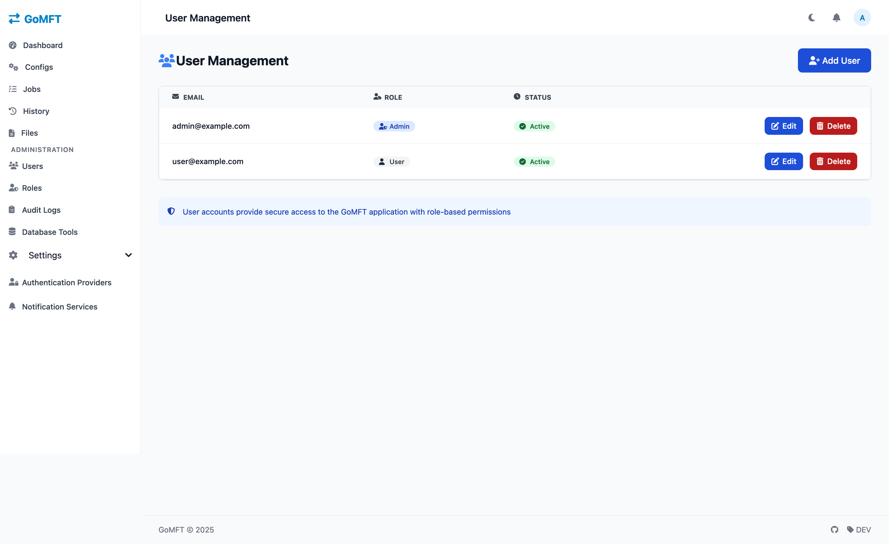

# GoMFT - Go Managed File Transfer

GoMFT is a web-based managed file transfer application built with Go, leveraging rclone for robust file transfer capabilities. It provides a user-friendly interface for configuring, scheduling, and monitoring file transfers across various storage providers.

## Screenshots

### Dashboard

*Dashboard showing active transfers and system status*


*Dashboard dark mode showing active transfers and system status*

### Configuration Interface

*Setting up transfer configurations with multiple storage options*

### Job Management

*Scheduling transfers with flexible cron expressions*

### User Management

*Create user accounts and manage them*


## Features

- **Multiple Storage Support**: Leverage rclone's extensive support for cloud storage providers:
  - Amazon S3
  - MinIO
  - Backblaze B2
  - Azure Blob Storage
  - Google Cloud Storage
  - SFTP
  - FTP
  - SMB/CIFS shares
  - Local filesystem
  - And more via rclone
- **Scheduled Transfers**: Configure transfers using cron expressions with flexible scheduling options
- **Transfer Monitoring**: Real-time status updates and detailed transfer logs with bytes and files transferred statistics
- **Web Interface**: User-friendly interface for managing transfers, built with Templ components
- **File Pattern Matching**: Support for file patterns to filter files during transfers
- **File Output Patterns**: Dynamic naming of destination files using patterns with date variables
- **Archive Function**: Option to archive transferred files for backup and compliance
- **Transfer Configurations**: Full control over source and destination connection parameters
- **Job Management**: Create, edit, and monitor transfer jobs with scheduling
- **Security**: Role-based access control with admin-managed user accounts and secure password management
- **Password Recovery**: Self-service password reset via email with secure token-based authentication
- **User Profile Management**: Personal settings including theme preferences
- **Modern UI**: Built with Templ, HTMX and Tailwind CSS for a responsive experience

## Prerequisites

- Go 1.21 or later
- rclone installed and configured
- SQLite 3

## Installation

1. Clone the repository:
```bash
git clone https://github.com/starfleetcptn/gomft.git
cd gomft
```

2. Install dependencies:
```bash
go mod download
```

3. Build the application:
```bash
go build -o gomft
```

## Configuration

GoMFT uses a configuration file located at `./data/gomft/config.json`. On first run, a default configuration will be created:

```json
{
  "server_address": ":8080",
  "data_dir": "./data/gomft",
  "backup_dir": "./data/gomft/backups",
  "jwt_secret": "your-secret-key",
  "base_url": "http://localhost:8080",
  "email": {
    "enabled": false,
    "host": "smtp.example.com",
    "port": 587,
    "username": "user@example.com",
    "password": "your-password",
    "from_email": "gomft@example.com",
    "from_name": "GoMFT",
    "reply_to": "",
    "enable_tls": true,
    "require_auth": true
  }
}
```

### Configuration Options

- `server_address`: The address and port to run the server on
- `data_dir`: Directory for storing application data
- `backup_dir`: Directory for storing database backups
- `jwt_secret`: Secret key for JWT token generation
- `base_url`: Base URL for generating links in emails (e.g., password reset links)
- `email`: Email configuration settings for system notifications and password resets
  - `enabled`: Set to `true` to enable email functionality
  - `host`: SMTP server hostname
  - `port`: SMTP server port (usually 587 for TLS, 465 for SSL, or 25 for non-secure)
  - `username`: Username for SMTP authentication
  - `password`: Password for SMTP authentication
  - `from_email`: Email address used as sender
  - `from_name`: Name displayed as the sender
  - `reply_to`: Optional reply-to email address
  - `enable_tls`: Set to `true` to use TLS for secure email transmission
  - `require_auth`: Set to `true` to require authentication for SMTP connections, or `false` for servers that don't need authentication

## Usage

1. Start the server:
```bash
./gomft
```

2. Access the web interface at `http://localhost:8080`

3. Log in with the default admin account:
   - Email: `admin@example.com`
   - Password: `admin`
   - **Important**: Change this password immediately after first login

4. Create transfer configurations:
   - Navigate to "Transfer Configs" section
   - Configure source and destination locations with connection details
   - Set file patterns and archive options as needed

5. Create jobs using your configurations:
   - Navigate to "Jobs" section
   - Select an existing transfer config
   - Set up a schedule using cron expressions or run manually
   - Enable/disable as needed

6. Monitor transfers:
   - View active and completed transfers on the Dashboard
   - Check detailed transfer history with performance metrics
   - View job run details including any error messages

### User Management

GoMFT uses a role-based access control system:

- **Administrators**: Can create and manage users, access all features
- **Regular Users**: Can manage transfers and view history

User management features:
- Only administrators can create new user accounts
- User passwords are securely hashed with bcrypt
- Password history tracking prevents reuse of recent passwords
- Account lockout after multiple failed login attempts
- Self-service password reset via secure email links
- JWT-based authentication with tokens
- User theme preference settings (light/dark)

### Transfer Configuration Options

1. **Source/Destination Types**:
   - Local filesystem
   - Amazon S3
   - MinIO (S3-compatible storage)
   - Backblaze B2
   - SFTP
   - FTP
   - SMB/CIFS shares
   - And many more via rclone

2. **Connection Options**:
   - Host/server addresses
   - Authentication (username/password or key files)
   - Port configurations
   - Cloud credentials (access keys, secret keys)
   - Bucket and region settings
   - Custom endpoints
   - Custom rclone flags

3. **File Options**:
   - File patterns for filtering (e.g., `*.txt`, `data_*.csv`)
   - Output patterns for dynamic naming
   - Archive options for transferred files

4. **Schedule Options**:
   - Cron expressions for flexible scheduling
   - Manual execution
   - Enable/disable schedules

### Email Notifications

GoMFT supports email notifications for various features:

- **Password Reset**: Users can request password reset links sent to their registered email
- **Styled Emails**: Professional HTML emails that match the application's design theme
- **Secure Tokens**: One-time use secure tokens with 15-minute expiration for enhanced security
- **Flexible Configuration**: Easily configure your SMTP server settings
- **Authentication Options**: Support for both authenticated and unauthenticated SMTP servers
- **TLS Support**: Secure communication with your SMTP server
- **Development Mode**: When emails are disabled, reset links are logged to the console

To configure email functionality:

1. Edit the `config.json` file and provide your SMTP server details
2. Set `"enabled": true` in the email configuration section
3. Ensure the `base_url` setting is configured correctly for your deployment

## Development

### Project Structure

```
.
├── components/     # Templ components for UI
├── internal/
│   ├── api/        # REST API handlers
│   ├── auth/       # Authentication/authorization
│   ├── config/     # Configuration management
│   ├── db/         # Database models and operations
│   ├── email/      # Email service for notifications and password resets
│   ├── scheduler/  # Job scheduling and execution
│   └── web/        # Web interface handlers
├── static/         # Static assets
│   ├── css/
│   └── js/
└── main.go        # Application entry point
```

### Technology Stack

- **Backend**: Go with Gin web framework
- **Frontend**: Templ for Go HTML components
- **UI Enhancement**: HTMX for dynamic interactions
- **Styling**: Tailwind CSS
- **Authentication**: JWT (JSON Web Tokens)
- **Database**: GORM with SQLite
- **File Transfer**: rclone

### Building from Source

1. Install development dependencies:
```bash
go install github.com/cosmtrek/air@latest  # Hot reload for development
go install github.com/a-h/templ/cmd/templ@latest # Templ template compiler
```

2. Generate template code:
```bash
templ generate
```

3. Run in development mode:
```bash
air
```

## Contributing

1. Fork the repository
2. Create a feature branch
3. Commit your changes
4. Push to the branch
5. Create a Pull Request

## License

MIT License - see LICENSE file for details
