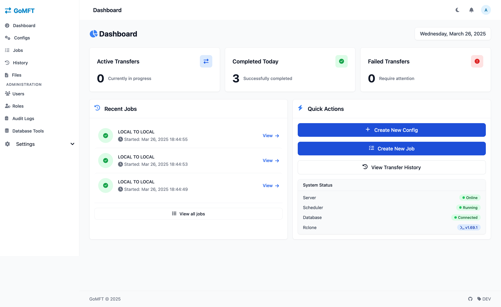

<p align="center">
  
</p>

<h1 align="center">GoMFT - Go Managed File Transfer</h1>

GoMFT is a web-based managed file transfer application built with Go, leveraging rclone for robust file transfer capabilities. It provides a user-friendly interface for configuring, scheduling, and monitoring file transfers across various storage providers.

<p align="center">
  <a href="https://discord.gg/f9dwtM3j">
    
  </a>
  <a href="https://starfleetcptn.github.io/GoMFT/">
    
  </a>
</p>

> [!WARNING]  
> This application is actively under development. As such, any aspect of the application—including configurations, data structures, and database fields—may change rapidly and without prior notice. Please review all release notes thoroughly before updating.

---

## Screenshots

<table>
<tr>
  <td width="33%">
    <a href="screenshots/dashboard.gomft.png">
      
    </a>
    <p align="center"><em>Dashboard showing active transfers</em></p>
  </td>
  <td width="33%">
    <a href="screenshots/dashboard.dark.gomft.png">
      
    </a>
    <p align="center"><em>Dashboard dark mode</em></p>
  </td>
</tr>
</table>

---

## Features

- **Multiple Storage Support**: Leverage rclone's extensive support for cloud storage providers:
  - Google Drive
  - Google Photos
  - Amazon S3
  - MinIO
  - NextCloud
  - WebDAV
  - SFTP
  - FTP
  - SMB/CIFS shares
  - Hetzner Storage Box
  - Backblaze B2
  - Wasabi
  - Local filesystem
  - And more via rclone
- **Webhook Notifications**: Receive real-time notifications of job events:
  - Configurable webhook URLs
  - HMAC-SHA256 authentication with secrets
  - Custom HTTP headers
  - Selectable events (job success, job failure)
  - Detailed JSON payload with job information
- **Multiple Notification Services**: Get job status updates through various notification channels:
  - Email notifications with configurable SMTP settings
  - Webhooks with authentication for custom integrations
  - Pushbullet notifications with optional device targeting
  - Ntfy.sh (both public and self-hosted) for simple push notifications
  - Gotify server integration for self-hosted notifications
  - Pushover notifications with customizable sounds and priorities
  - Configurable message templates for all notification types
  - Event-based triggers (job start, completion, errors)
- **Scheduled Transfers**: Configure transfers using cron expressions with flexible scheduling options
- **Transfer Monitoring**: Real-time status updates and detailed transfer logs with bytes and files transferred statistics
- **File Metadata Tracking**: Complete history and status of all transferred files with detailed information:
  - Process status (processed, archived, deleted)
  - File size and hash information
  - Advanced search and filtering capabilities
  - Metadata retention for compliance and auditing
  - Detailed file view with processing timestamps and job association
  - Powerful filtering by status, filename, job, and date ranges
  - Advanced search interface with multiple criteria
  - Bulk management and record deletion capabilities
  - Responsive design with mobile-friendly interface
- **Multi-threaded File Transfers**: Significantly improve performance with concurrent file processing:
  - Configurable number of concurrent transfers (1-32) per job
  - Automatic queue management to prevent system overload
  - Independent configuration for each transfer job
  - Optimized for both high-volume small files and large file transfers
  - Maximizes bandwidth utilization for cloud storage providers
- **Web Interface**: User-friendly interface for managing transfers, built with Templ components
- **File Pattern Matching**: Support for file patterns to filter files during transfers
- **File Output Patterns**: Dynamic naming of destination files using patterns with date variables
- **Archive Function**: Option to archive transferred files for backup and compliance
- **Transfer Configurations**: Full control over source and destination connection parameters
- **Job Management**: Create, edit, and monitor transfer jobs with scheduling
- **Security**: Role-based access control with admin-managed user accounts and secure password management
- **Authentication Providers**: Flexible authentication options:
  - Built-in email/password authentication
  - Authentik integration for enterprise SSO
  - OpenID Connect (OIDC) support for standard identity providers
  - OAuth2 integration for popular providers (Google, GitHub, etc.)
  - Multiple provider support with fallback options
  - Automatic user provisioning from external providers
  - Role mapping from external identity providers
- **Password Recovery**: Self-service password reset via email with secure token-based authentication
- **User Profile Management**: Personal settings including theme preferences
- **Modern UI**: Built with Templ, HTMX and Tailwind CSS for a responsive experience
- **Docker Support**: Easy deployment with Docker images and Docker Compose support
- **Portable Deployment**: Run on any platform that supports Docker or Go

---

## Prerequisites

- Go 1.21 or later
- rclone installed and configured
- SQLite 3

---

## Installation

### Standard Installation

1. Clone the repository:
```bash
git clone https://github.com/starfleetcptn/gomft.git
cd gomft
```

2. Install dependencies:
```bash
go mod download
```

3. Build the application:
```bash
go build -o gomft
```

### Docker Installation

GoMFT is available as a Docker image for quick and easy deployment.

1. Pull the latest image from Docker Hub:
```bash
docker pull starfleetcptn/gomft:latest
```

2. Run the container:

#### Basic run
```bash
docker run -d \
  --name gomft \
  -p 8080:8080 \
  -v /path/to/data:/app/data \
  -v /path/to/backups:/app/backups \
  starfleetcptn/gomft:latest
```

#### Run with specific user ID and group ID (using environment variables)
```bash
docker run -d \
  --name gomft \
  -p 8080:8080 \
  -v /path/to/data:/app/data \
  -v /path/to/backups:/app/backups \
  -e PUID=$(id -u) \
  -e PGID=$(id -g) \
  starfleetcptn/gomft:latest
```

#### Or specify user IDs directly
```bash
docker run -d \
  --name gomft \
  -p 8080:8080 \
  -v /path/to/data:/app/data \
  -v /path/to/backups:/app/backups \
  -e PUID=1001 \
  -e PGID=1001 \
  starfleetcptn/gomft:latest
```

#### Using a .env file for configuration
```bash
docker run -d \
  --name gomft \
  -p 8080:8080 \
  -v /path/to/data:/app/data \
  -v /path/to/backups:/app/backups \
  -v /path/to/.env:/app/.env \
  -e PUID=$(id -u) \
  -e PGID=$(id -g) \
  starfleetcptn/gomft:latest
```
3. Access the web interface at `http://localhost:8080`

#### Docker Compose Example

For production deployments, you can use Docker Compose with environment variables:

```yaml
version: '3'
services:
  gomft:
    image: starfleetcptn/gomft:latest
    container_name: gomft
    restart: unless-stopped
    ports:
      - "8080:8080"
    volumes:
      - ./data:/app/data
      - ./backups:/app/backups
      - ./.env:/app/.env
    environment:
      - PUID=1000
      - PGID=1000
      - TZ=UTC
      - SERVER_ADDRESS=:8080
      - DATA_DIR=/app/data
      - BACKUP_DIR=/app/backups
      - JWT_SECRET=change_this_to_a_secure_random_string
      - BASE_URL=http://localhost:8080
      - GOOGLE_CLIENT_ID=your_google_client_id
      - GOOGLE_CLIENT_SECRET=your_google_client_secret
      - TOTP_ENCRYPTION_KEY=your_32_byte_encryption_key_here
      - EMAIL_ENABLED=true
      - EMAIL_HOST=smtp.example.com
      - EMAIL_PORT=587
      - EMAIL_FROM_EMAIL=gomft@example.com
      - EMAIL_FROM_NAME=GoMFT
      - EMAIL_ENABLE_TLS=true
      - EMAIL_REQUIRE_AUTH=true
      - EMAIL_USERNAME=smtp_username
      - EMAIL_PASSWORD=smtp_password
      - LOGS_DIR=/app/data/logs
      - LOG_MAX_SIZE=10
      - LOG_MAX_BACKUPS=5
      - LOG_MAX_AGE=30
      - LOG_COMPRESS=true
      - LOG_LEVEL=info
    # The user directive is no longer needed when using PUID/PGID environment variables
```
Save this as `docker-compose.yml` and run:

```bash
docker-compose up -d
```

For more information and available tags, visit the [GoMFT Docker Hub page](https://hub.docker.com/r/starfleetcptn/gomft).

---

## Configuration

GoMFT uses an environment file located at `.env` in the root directory of the application. On first run, a default configuration will be created:

```ini
# Basic configuration
SERVER_ADDRESS=:8080
DATA_DIR=/app/data
BACKUP_DIR=/app/backups
JWT_SECRET=change_this_to_a_secure_random_string
BASE_URL=http://localhost:8080

# Google OAuth configuration (optional, for built-in authentication)
GOOGLE_CLIENT_ID=your_google_client_id
GOOGLE_CLIENT_SECRET=your_google_client_secret

# Email configuration
EMAIL_ENABLED=true
EMAIL_HOST=smtp.example.com
EMAIL_PORT=587
EMAIL_FROM_EMAIL=gomft@example.com
EMAIL_FROM_NAME=GoMFT
EMAIL_REPLY_TO=
EMAIL_ENABLE_TLS=true
EMAIL_REQUIRE_AUTH=true
EMAIL_USERNAME=smtp_username
EMAIL_PASSWORD=smtp_password

# Two-Factor Authentication configuration
TOTP_ENCRYPTION_KEY=your_32_byte_encryption_key_here

# UserID and GroupID
PUID=1000
PGID=1000
```

### Configuration Options

- `SERVER_ADDRESS`: The address and port to run the server on
- `DATA_DIR`: Directory for storing application data (database and configs)
- `BACKUP_DIR`: Directory for storing database backups
- `JWT_SECRET`: Secret key for JWT token generation
- `BASE_URL`: Base URL for generating links in emails (e.g., password reset links)
- Google OAuth configuration for built-in authentication:
  - `GOOGLE_CLIENT_ID`: Your Google OAuth client ID
  - `GOOGLE_CLIENT_SECRET`: Your Google OAuth client secret
- Email configuration settings for system notifications and password resets:
  - `EMAIL_ENABLED`: Set to `true` to enable email functionality
  - `EMAIL_HOST`: SMTP server hostname
  - `EMAIL_PORT`: SMTP server port (usually 587 for TLS, 465 for SSL, or 25 for non-secure)
  - `EMAIL_USERNAME`: Username for SMTP authentication
  - `EMAIL_PASSWORD`: Password for SMTP authentication
  - `EMAIL_FROM_EMAIL`: Email address used as sender
  - `EMAIL_FROM_NAME`: Name displayed as the sender
  - `EMAIL_REPLY_TO`: Optional reply-to email address
  - `EMAIL_ENABLE_TLS`: Set to `true` to use TLS for secure email transmission
  - `EMAIL_REQUIRE_AUTH`: Set to `true` to require authentication for SMTP connections, or `false` for servers that don't need authentication

- Two-Factor Authentication (2FA) configuration:
  - `TOTP_ENCRYPTION_KEY`: Secret key used to encrypt/decrypt TOTP secrets (for 2FA)
    - Should be exactly 32 bytes (characters) for optimal security
    - If not set, a default development key will be used (not secure for production)
    - If shorter than 32 bytes, it will be automatically padded (less secure)
    - If longer than 32 bytes, it will be truncated to 32 bytes
    - Example: `TOTP_ENCRYPTION_KEY=abcdefghijklmnopqrstuvwxyz123456`


- SSL/TLS Verification Control:
  - `SKIP_SSL_VERIFY`: Set to `true` to disable SSL/TLS certificate verification for outgoing connections (e.g., webhooks, email). Use with caution, as this can expose connections to man-in-the-middle attacks. Defaults to `false` (verification enabled).
    - Example: `SKIP_SSL_VERIFY=true`
### Logging Configuration

GoMFT provides configurable logging with rotation support through the following environment variables:

- `LOGS_DIR`: Directory where log files are stored (default: `./data/logs`)
- `LOG_MAX_SIZE`: Maximum size in megabytes for each log file before rotation (default: `10`)
- `LOG_MAX_BACKUPS`: Number of old log files to retain (default: `5`)
- `LOG_MAX_AGE`: Maximum number of days to retain old log files (default: `30`)
- `LOG_COMPRESS`: Whether to compress rotated log files (default: `true`)
- `LOG_LEVEL`: Controls verbosity level of logging (values: `error`, `info`, `debug`, default: `info`)
  - `error`: Only show errors and critical issues
  - `info`: Show errors and general operational information (default)
  - `debug`: Show all messages including detailed debugging information

Log files contain detailed information about file transfers, job execution, and system operations, which can be useful for troubleshooting and auditing.

---

## Usage

1. Start the server:
```bash
./gomft
```

2. Access the web interface at `http://localhost:8080`

3. Log in with the default admin account:
   - Email: `admin@example.com`
   - Password: `admin`
   - **Important**: Change this password immediately after first login

4. Create transfer configurations:
   - Navigate to "Transfer Configs" section
   - Configure source and destination locations with connection details
   - Set file patterns and archive options as needed
   - Configure performance settings:
     - Set "Concurrent Transfers" slider to optimize throughput
     - Use higher values (8-16) for many small files or fast networks
     - Use lower values (1-4) for large files or limited bandwidth
     - Consider source/destination system capabilities when setting

5. Create jobs using your configurations:
   - Navigate to "Jobs" section
   - Select an existing transfer config
   - Use the visual schedule builder to set your timing preferences:
     - Choose from common presets (hourly, daily, weekly, monthly)
     - Customize with specific days, times, or intervals
     - See a plain-language description of your schedule
     - View upcoming run times on the interactive calendar
     - Switch to advanced mode for direct cron expression input if needed
   - Enable/disable jobs with a single click

6. Monitor transfers:
   - View active and completed transfers on the Dashboard
   - Check detailed transfer history with performance metrics
   - View job run details including any error messages

7. Configure webhook notifications:
   - Enable webhooks in job settings to receive notifications
   - Provide a valid webhook URL where notifications will be sent
   - Optionally set a webhook secret for HMAC-SHA256 signature verification
   - Configure custom HTTP headers in JSON format if needed
   - Choose notification triggers (job success, job failure, or both)
   - Test your webhook integration with manual job runs

8. **Webhook Notifications**:
   - **Webhook Integration**: Send notifications to external systems when jobs complete
   - **Secure Authentication**: HMAC-SHA256 signature for webhook verification
   - **Custom Headers**: Add custom HTTP headers to webhook requests
   - **Flexible Configuration**: Configure different webhooks for different jobs
   - **Event Selection**: Choose to send notifications on success, failure, or both
   - **Detailed Payload**: Rich JSON payload with complete job execution details

9. **Multiple Notification Services**:
   - **Pushbullet Integration**: Send notifications to your devices through Pushbullet
     - Device targeting support for specific device delivery
     - Customizable title and message templates
     - API key-based authentication
   - **Ntfy Integration**: Use public ntfy.sh or self-hosted ntfy server
     - Topic-based routing of notifications
     - Priority levels for different job events
     - Optional username/password authentication for private servers
     - Customizable title and message templates
   - **Gotify Integration**: Send notifications to self-hosted Gotify servers
     - Application token-based authentication
     - Priority levels (1-10) for different notification importance
     - Customizable title and message templates
   - **Pushover Integration**: Professional notification delivery service
     - Application and user key authentication
     - Device targeting for selective delivery
     - Sound selection for different notification types
     - Priority levels from lowest to emergency
     - Customizable title and message templates
   - **Common Features**:
     - Variable substitution in notification templates
     - Job data access in templates (status, files, bytes, times)
     - Event-based filtering (job start, completion, errors)
     - Success/failure tracking for diagnostic purposes

10. Manage file metadata:
   - Navigate to the "Files" section to view all processed files
   - Use filters to quickly find files by status, job ID, or filename
   - Click on any file to view detailed metadata including timestamps, size, and hash
   - Use the advanced search page for complex queries with multiple criteria
   - Delete file metadata records when no longer needed
   - View files associated with specific jobs by navigating from the job details

11. Utilize admin tools (administrators only):
   - Access the "Admin Tools" section from the navigation menu
   - View system statistics and server information
   - Create and manage database backups
   - Browse and download system log files with the integrated log viewer
   - Perform database maintenance and optimization tasks
   - View webhook documentation and integration details

### User Management

GoMFT uses a role-based access control system with flexible authentication options:

- **Administrators**: Can create and manage users, access all features
- **Regular Users**: Can manage transfers and view history

#### Authentication Options

1. **Built-in Authentication**:
   - Email/password login with secure password hashing
   - JWT-based session management
   - Password history tracking
   - Account lockout protection
   - Self-service password reset

2. **External Authentication Providers**:
   - **Authentik Integration**:
     - Enterprise-grade SSO capabilities
     - Automatic user provisioning
     - Role synchronization
     - Group mapping support
     - Secure token exchange

   - **OpenID Connect (OIDC)**:
     - Standard-compliant identity provider support
     - Automatic user creation and updates
     - Role mapping from OIDC claims
     - Multiple provider support
     - Secure token validation

   - **OAuth2 Providers**:
     - Google authentication
     - GitHub integration
     - Other OAuth2-compliant providers
     - Custom provider configuration
     - Automatic profile synchronization

3. **Security Features**:
   - Secure password hashing with bcrypt
   - JWT-based authentication with tokens
   - Password history tracking prevents reuse
   - Account lockout after failed attempts
   - Two-factor authentication support
   - Session management and timeout
   - Secure token storage and handling

4. **User Profile Management**:
   - Theme preferences (light/dark mode)
   - Profile information updates
   - Password change functionality
   - Two-factor authentication setup
   - External account linking

### Two-Factor Authentication (2FA) Implementation

#### Overview
This implementation adds TOTP-based (Time-based One-Time Password) two-factor authentication support to the application, compatible with standard authenticator apps like Google Authenticator, Authy, and others.

#### Features
- TOTP-based authentication (RFC 6238 compliant)
- QR code setup for easy enrollment
- Backup codes for account recovery
- Rate-limited verification attempts
- Secure secret storage

#### Database Changes
The following fields have been added to the `users` table:
- `two_factor_secret`: Stores the TOTP secret key
- `two_factor_enabled`: Boolean flag indicating if 2FA is enabled
- `backup_codes`: Stores recovery backup codes

#### Setup Process
1. Navigate to `/profile/2fa/setup`
2. Scan the displayed QR code with your authenticator app
3. Enter the verification code to confirm setup
4. Save your backup codes in a secure location

#### Login Flow
1. Enter email and password as usual
2. If 2FA is enabled:
   - Enter the 6-digit code from your authenticator app
   - Alternatively, use a backup code if you can't access your authenticator

#### Security Considerations
- The TOTP secrets are encrypted using AES-256-GCM
- You must set the `TOTP_ENCRYPTION_KEY` environment variable in production
- This key should be 32 bytes (characters) long and kept confidential
- Changing this key after users have set up 2FA will invalidate their existing 2FA configurations
- For high-security deployments, store this key in a secure vault and inject it at runtime

### Transfer Configuration Options

1. **Source/Destination Types**:
   - Google Drive
   - Google Photos
   - Local filesystem
   - Amazon S3
   - MinIO (S3-compatible storage)
   - NextCloud
   - Backblaze B2
   - Wasabi
   - Hetzner Storage Box
   - SFTP
   - FTP
   - SMB/CIFS shares
   - And many more via rclone

2. **Connection Options**:
   - Host/server addresses
   - Authentication (username/password or key files)
   - OAuth2 authentication for Google services
   - Port configurations
   - Cloud credentials (access keys, secret keys)
   - Bucket and region settings
   - Custom endpoints
   - Custom rclone flags

3. **Google Photos Specific Options**:
   - Read-only mode for safer operations
   - Start year filter for historical photos
   - Include/exclude archived media
   - Album path configuration
   - Built-in or custom OAuth authentication

4. **Google Drive Specific Options**:
   - Folder ID for specific directory access
   - Team/Shared Drive ID support
   - Built-in or custom OAuth authentication
   - Path-based navigation

5. **File Options**:
   - File patterns for filtering (e.g., `*.txt`, `data_*.csv`)
   - Output patterns for dynamic naming
   - Archive options for transferred files
   - Skip already processed files to avoid duplicates
   - Concurrent file transfers (configurable per job)

6. **Performance Options**:
   - **Multi-threaded File Transfers**: Process multiple files simultaneously for higher throughput
   - Configurable concurrency level (1-32 concurrent transfers)
   - Per-job concurrency settings to optimize for different storage types
   - Automatic transfer queue management to prevent overloading systems
   - Adaptive processing based on source/destination capabilities

7. **Schedule Options**:
   - **Visual Schedule Builder**: Intuitive interface for setting schedule preferences
   - **Natural Language Description**: Plain-language description of schedule
   - **Interactive Calendar**: Visual representation of upcoming runs
   - **Common Presets**: Hourly, daily, weekly, monthly schedules
   - **Advanced Mode**: Manual cron expression input for complex schedules
   - **Schedule Validation**: Preview and confirm schedule
   - **Enable/Disable**: One-click enable/disable
   - **Time Zone Support**: Accurate scheduling based on user's time zone

8. **Notification Options**:
   - **Email Notifications**: Receive job status updates via email
   - **Webhook Notifications**: Integration with external systems
   - **Pushbullet**: Push notifications to your devices
   - **Ntfy**: Simple push notifications via ntfy.sh
   - **Gotify**: Self-hosted notification server integration
   - **Pushover**: Professional notification service
   - Configure event triggers (start, complete, error)
   - Customize notification message templates
   - Selective notification based on job status

### Email Notifications

GoMFT supports email notifications for various features:

- **Password Reset**: Users can request password reset links sent to their registered email
- **Styled Emails**: Professional HTML emails that match the application's design theme
- **Secure Tokens**: One-time use secure tokens with 15-minute expiration for enhanced security
- **Flexible Configuration**: Easily configure your SMTP server settings
- **Authentication Options**: Support for both authenticated and unauthenticated SMTP servers
- **TLS Support**: Secure communication with your SMTP server
- **Development Mode**: When emails are disabled, reset links are logged to the console

To configure email functionality:

1. Edit the `.env` file and provide your SMTP server details
2. Set `EMAIL_ENABLED=true` in the email configuration section
3. Ensure the `BASE_URL` setting is configured correctly for your deployment

### Webhook Integration

GoMFT can send webhook notifications to external systems when jobs complete. This allows integration with monitoring tools, chat applications, custom notification systems, or workflow automation platforms.

#### Webhook Payload Structure

Webhook notifications are sent as HTTP POST requests with a JSON payload containing detailed information about the job execution:

```json
{
  "event_type": "job_execution",
  "job_id": 123,
  "job_name": "Daily Backup",
  "config_id": 456,
  "config_name": "S3 to Local Backup",
  "status": "completed",
  "start_time": "2023-07-14T15:30:00Z",
  "end_time": "2023-07-14T15:35:42Z",
  "duration_seconds": 342,
  "bytes_transferred": 1048576,
  "files_transferred": 25,
  "history_id": 789,
  "source": {
    "type": "s3",
    "path": "my-bucket/data"
  },
  "destination": {
    "type": "local",
    "path": "/backups/data"
  }
}
```

For failed transfers, additional error information is included:

```json
{
  "status": "failed",
  "error_message": "Permission denied accessing destination path"
}
```

#### Webhook Authentication

When a webhook secret is configured, GoMFT signs the payload using HMAC-SHA256 and includes the signature in the `X-Hub-Signature-256` header. To verify the webhook:

1. Compute the HMAC-SHA256 of the raw request body using your shared secret
2. Compare it with the value in the `X-Hub-Signature-256` header
3. Process the webhook only if the signatures match

This ensures that webhook requests are authentic and haven't been tampered with.

### Admin Tools

GoMFT provides a comprehensive set of administrative tools for system management and monitoring:

#### Log Viewer

The Admin Tools panel includes an integrated log viewer with the following features:

- **Log File Browser**: View a list of all available log files in the system
- **Real-time Log Viewing**: View log file contents directly in the web interface
- **Refresh Function**: Update the log list and content with the latest information
- **User-friendly Interface**: Clean, readable presentation with custom scrolling
- **Dark Mode Support**: Consistent theming with the rest of the application
- **Navigation**: Easily switch between different log files

This log viewer allows administrators to:
- Monitor system activity and diagnose issues without requiring server access
- View application logs, scheduler logs, and transfer logs in one place
- Track down errors and warning messages in real-time

#### Database Management

The Admin Tools interface also includes database management capabilities:
- Create and manage database backups
- Restore from previous backups
- Download backups for safekeeping
- View system statistics
- Optimize the database with maintenance tools

---

## Development

### Project Structure

```
.
├── components/     # Templ components for UI
├── internal/
│   ├── api/        # REST API handlers
│   ├── auth/       # Authentication/authorization
│   ├── config/     # Configuration management
│   ├── db/         # Database models and operations
│   ├── email/      # Email service for notifications and password resets
│   ├── scheduler/  # Job scheduling and execution
│   └── web/        # Web interface handlers
├── static/         # Static assets
│   ├── css/
│   └── js/
└── main.go        # Application entry point
```

### Technology Stack

- **Backend**: Go with Gin web framework
- **Frontend**: Templ for Go HTML components
- **UI Enhancement**: HTMX for dynamic interactions
- **Styling**: Tailwind CSS
- **Authentication**: JWT (JSON Web Tokens)
- **Database**: GORM with SQLite
- **File Transfer**: rclone
- **Deployment**: Docker containerization and traditional installation

### Building from Source

1. Install development dependencies:
```bash
go install github.com/cosmtrek/air@latest  # Hot reload for development
go install github.com/a-h/templ/cmd/templ@latest # Templ template compiler
```

2. Generate template code:
```bash
templ generate
```

3. Run in development mode:
```bash
air
```

---

## Contributing

1. Fork the repository
2. Create a feature branch
3. Commit your changes
4. Push to the branch
5. Create a Pull Request

---

## Directory Structure

GoMFT uses the following directory structure:

- `/app/data`: Main application data directory
  - Contains the SQLite database (`gomft.db`)
  - Contains rclone configurations in `/app/data/configs`
  - Contains log files in `/app/data/logs`
- `/app/backups`: Database backup directory

When using Docker, you should mount volumes to these locations:

```yaml
volumes:
  - /host/path/data:/app/data         # For all application data
  - /host/path/backups:/app/backups   # For database backups
```

These paths can be customized using the environment variables `